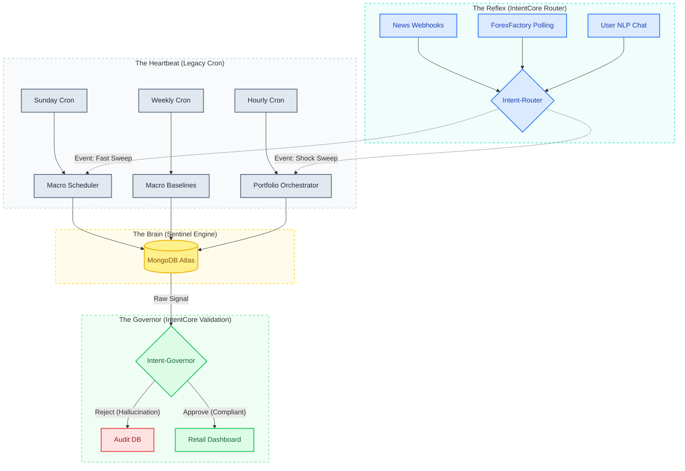

# 🚀 Sentinel: Autonomous Financial Intelligence

Sentinel is a fully autonomous, mathematically rigorous market intelligence engine built to track the U.S. Economy in real-time. 

Powered by **IntentCore** and a robust **MongoDB Atlas** backbone, the system continuously executes a multi-layered analytical orchestra:

🌍 **Macro-Economic Reality Tracking**
Sentinel continuously scrapes the global economic calendar for 16 core indicators (from CPI to GDP). It computes the exact *market surprise* of these events by cross-referencing live prints against mathematically-derived rolling standard deviations.

🧠 **Bottom-Up Sector Scoring**
Sentinel tracks the 11 major S&P 500 Sector ETFs (plus QQQ) by semantically analyzing live news for their ~520 underlying constituent companies. Using **LangGraph**, it rolls this granular data into a bottom-up sector sentiment score. 

⚡ **The Reflex Router**
Breaking news doesn't wait for a cron job. Sentinel exposes high-speed **FastAPI Webhooks** that intercept live alerts, run them through a **LangChain Semantic Router**, and instantly trigger background analysis on the exact tickers or events that are moving the market.

⚖️ **The Intent Governor**
Sentinel operates with strict financial guardrails. A specialized LangGraph node serves as the final Back-Door Governor—evaluating every signal for anomalies like massive allocation turnover or missing data. If an anomaly is detected, the Governor applies safe mathematical baselines in the background, or explicitly halts the pipeline to queue a manual review for the Portfolio Manager.

⚙️ **Dynamic Calibration**
Finally, Sentinel mathematically shocks these sector scores using the current Macro-Economic Reality—weighted by each sector's specific Beta sensitivities—to output the true, context-aware "Effective Sentiment" of the U.S. economy.

*100% Untethered. 100% Autonomous. The ultimate edge in quantitative sentiment analysis.* 📈🤖

---

## 🏛️ System Architecture



---

## 📖 Project Documentation

To avoid duplicating reference content and maintain a single source of truth, all architecture designs, database schemas, coding standards, and execution maps are hosted in the **Central Documentation Catalog**:

👉 **[Central Documentation Catalog](file:///d:/PartnaStudio/sentinel/sentiment/docs/README.md)**

Inside the docs catalog, you will find:

* **[Strategic Core](file:///d:/PartnaStudio/sentinel/sentiment/docs/Strategic%20Core/)**: Main system topologies, roadmaps, and DB velocity reports.
* **[Technical Reference](file:///d:/PartnaStudio/sentinel/sentiment/docs/Technical%20Reference/)**: Mathematical scoring equations, LangGraph routing flows, and developer standards.
* **[Coverage](file:///d:/PartnaStudio/sentinel/sentiment/docs/Coverage/)**: News provider support status matrices and model capability comparisons.
* **[Workarounds](file:///d:/PartnaStudio/sentinel/sentiment/docs/Workarounds/)**: Integration bug-fixes and offline backtesting guidelines.

---

## 🚀 Quick Start & Installation

1. **Configure Environment Variables**:
   Create a `.env.local` file inside the `sentiment` folder (matching `sentiment/.env.example`).
2. **Initialize Local Virtual Environment**:

   ```bash
   python -m venv venv
   # On Windows:
   .\venv\Scripts\activate
   # On Unix/macOS:
   source venv/bin/activate
   pip install -r requirements.txt
   ```

---

## 💻 Running the Pipelines (On-Demand)

Run manual on-demand triggers or local testing sweeps with these concise CLI commands:

### 1. Macro Ingestion & Scheduler Sweeps

* **Surprise Calculation**: `python scripts/macro_ingestion_cli.py --event "CPI m/m" --indicator CPI`
* **Weekly Calendar Scrape**: `python scripts/macro_scheduler_cli.py --fetch`
* **Realized Calendar Sweep**: `python scripts/macro_scheduler_cli.py --sweep`
* **Baseline Standard Deviation Sync (Full)**: `python scripts/macro_baselines_cli.py --limit all`
* **Baseline Standard Deviation Sync (Batch)**: `python scripts/macro_baselines_cli.py --limit 5`
* **Baseline Standard Deviation Sync (Individual)**: `python scripts/macro_baselines_cli.py --update "CPI m/m"`

### 2. Sentiment Ingestion & ETF Sweeps

* **Single Stock Sentiment**: `python scripts/news_sentiment_cli.py --ticker MSFT --limit 10`
* **ETF Constituents Sentiment**: `python scripts/news_sentiment_cli.py --ticker QQQ --holdings 5`

---

## 🤖 Running the Autonomous System (Background Production Mode)

In production, Sentinel runs as continuous background processes synchronizing state via MongoDB.

* **Macro Scheduler Daemon**: `python scripts/macro_scheduler_cli.py` (Sunday scrapes calendar; hourly checking for new realized indicators).
* **Macro Baselines Refresh Daemon**: `python scripts/macro_baselines_cli.py --limit all` (Runs weekly via cron schedule to synchronize rolling standard deviations. Script natively enforces 15-second delays between pulls to adhere to API limits).
* **Sentiment Portfolio Orchestrator**: `python scripts/sentinel_orchestrator.py --background` (Hourly scans MongoDB Core ETFs and calculates sentiment).
  * *Note: Automatically sets holdings argument to `all` internally for Core ETFs.*
