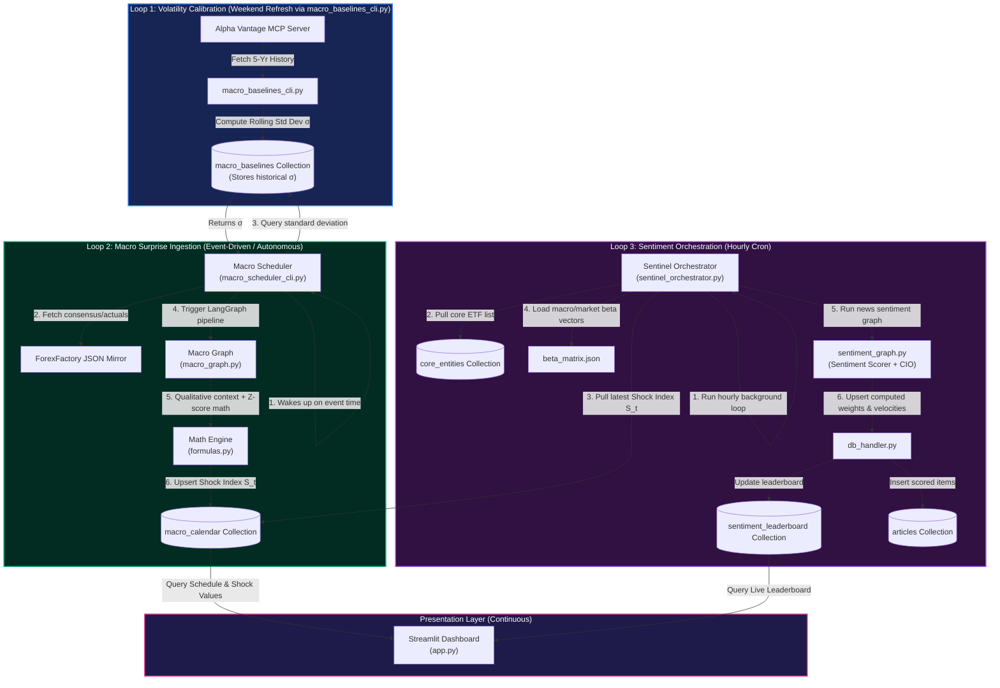
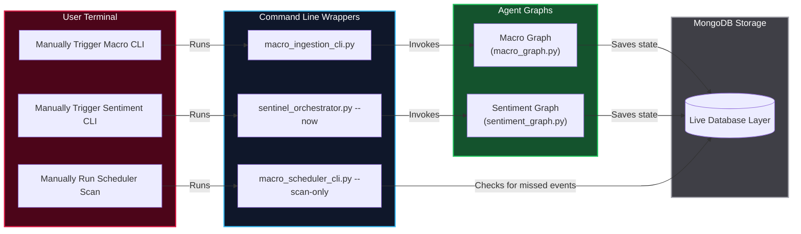
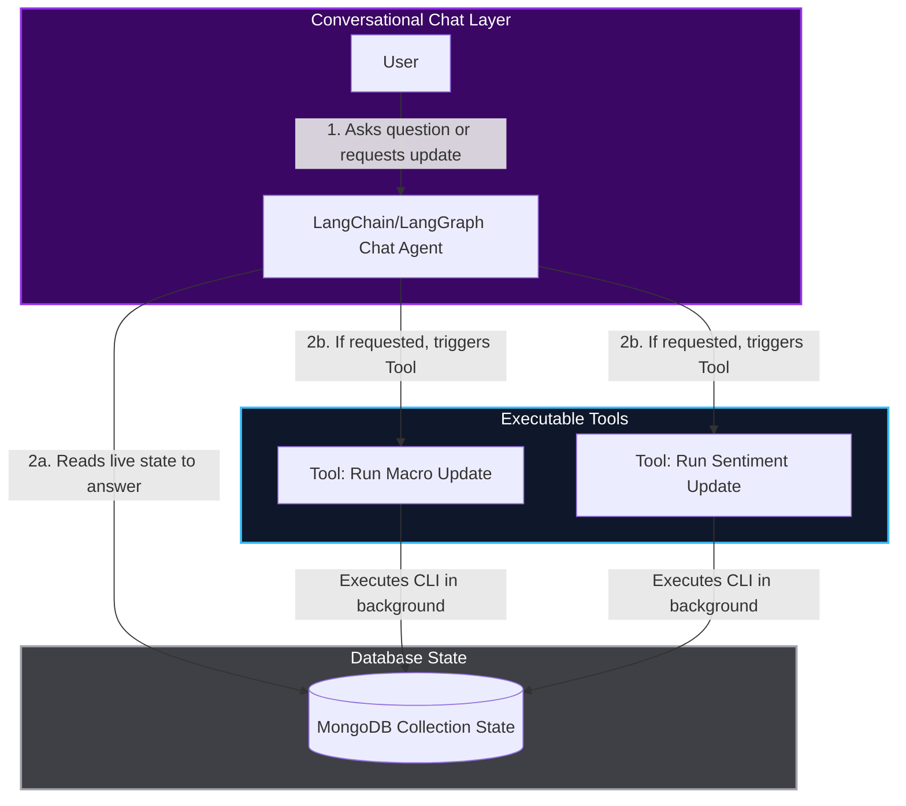

# Sentinel Pipeline Coordination & Architecture Diagram

This document illustrates how the different components of the Sentinel pipeline run autonomously in the background, while still allowing for manual, ad-hoc execution of any agent or scheduler.

---

## 1. Autonomous System Architecture (Background Operations)

The following diagram illustrates the three distinct, fully autonomous execution loops that run in production. They coordinate state asynchronously using the MongoDB database.

---

## 2. Manual / Ad-Hoc Invocation Architecture

While the system is fully autonomous, every component is decoupled and wrapped in a CLI or callable interface. This allows developers or a future "Chat Layer" to manually trigger updates on-demand without interrupting the background loops.

### Command-Line Ad-Hoc Triggers
This graph shows how a user can invoke the individual CLIs directly from the terminal.

### Conversational Chat Layer Integration
Because the entire system writes its output to MongoDB, a conversational AI interface (Chat Layer) can easily be layered over the DB. The chatbot can read the live DB state to answer questions, and it can be given access to trigger the CLIs as background tools when requested.

