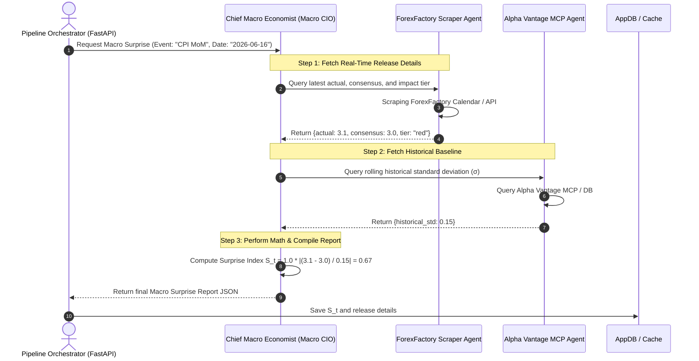

# Macro Ingestion Strategy & Multi-Agent Architecture

This document describes the design of the **Macro Ingestion Strategy** and how it integrates with the overall Sentiment Alpha pipeline. It details the multi-agent delegation flow, the mathematical requirements, and the data contracts needed to feed the portfolio rebalancing engine.

---

## 1. Mathematical Requirements & Inputs

The goal of the Macro Ingestion pipeline is to calculate the **Macro Severity Surprise Index ($\mathcal{S}_t$)** for a specific economic indicator (e.g., *CPI MoM*, *Non-Farm Payrolls*).

$$\mathcal{S}_t = \omega_{\text{static}} \times \left| \frac{\text{Actual}_t - \text{Consensus}_t}{\sigma_{\text{historical}}} \right|$$

To compute this, we need to gather the following numbers:

| Variable | Name | Source | Description |
| :--- | :--- | :--- | :--- |
| $\text{Actual}_t$ | Actual | ForexFactory Scraper | The real-time released value for the macro event. |
| $\text{Consensus}_t$ | Consensus | ForexFactory Scraper | The forecast consensus value expected by the market. |
| $\omega_{\text{static}}$ | Tier Weight | ForexFactory Scraper | The event's impact tier (Red = 1.0, Orange = 0.5, Yellow = 0.2). |
| $\sigma_{\text{historical}}$ | Historical Std Dev | Alpha Vantage MCP | The rolling historical standard deviation of the indicator's surprises. |

---

## 2. Multi-Agent Delegation Architecture

Yes, the macro ingestion pipeline follows a similar orchestrator-delegator model to our sentiment analysis pipeline. 

We will introduce a **Chief Macro Economist (Macro CIO) Agent** that acts as the coordinator. It does not scrape or query APIs directly; instead, it coordinates two specialized "synth" agents and compiles their findings.

### Multi-Agent Interaction Diagram



### Agent Roles

1. **Chief Macro Economist (Macro CIO):**
   * **Role:** Orchestrator.
   * **Responsibilities:** Receives the target event, spawns nested chats with the delegators, performs the mathematical calculation of $\mathcal{S}_t$, and formats the final JSON output.
2. **ForexFactory Scraper Agent:**
   * **Role:** Real-time data harvester.
   * **Responsibilities:** Crawls the ForexFactory calendar or utilizes an internal scraper utility to extract the `actual` value, `consensus` forecast, and `impact_tier` label for the economic calendar event.
3. **Alpha Vantage MCP Agent:**
   * **Role:** Historical baseline engine.
   * **Responsibilities:** Connects to the Alpha Vantage MCP server (`mcp.alphavantage.co/mcp`) to retrieve historical release tables for the event, computes the rolling standard deviation ($\sigma$) of historical surprises, and returns it.

---

## 3. Data Contracts & Output Schema

The final report compiled by the **Chief Macro Economist** matches the following schema contract, making it clean and easy for the downstream FastAPI data worker or database handler to consume:

```json
{
  "event_name": "Consumer Price Index MoM",
  "category": "Inflation",
  "timestamp": "2026-06-16T12:30:00Z",
  "data": {
    "actual": 3.1,
    "consensus": 3.0,
    "difference": 0.1,
    "historical_std": 0.15,
    "impact_tier": "red"
  },
  "metrics": {
    "macro_surprise_score": 0.67,
    "warning_flag": false,
    "warning_message": null
  },
  "reasoning_summary": "The CPI MoM released at 3.1% vs. 3.0% consensus. This positive surprise (+0.1%) represents a moderate macro shock (0.67 index) given historical standard deviations, driven by sticky energy prices."
}
```

---

## 4. Fallback Guardrails (Self-Healing Calculations)

If either agent encounters an error, the Macro CIO enforces technical safety guardrails:

* **Scraper Block / Missing Values:** If ForexFactory scraping is blocked or consensus is missing, the Macro CIO sets `macro_surprise_score = 0.0` and raises `warning_flag = True`, preventing downstream rebalancing from triggering off malformed inputs.
* **Division-by-Zero (Zero Standard Deviation):** If Alpha Vantage reports `historical_std = 0.0` or `None`, the standard deviation denominator falls back to `1.0` and triggers a warning: `"Zero or invalid historical standard deviation; fallback denominator of 1.0 used."`
