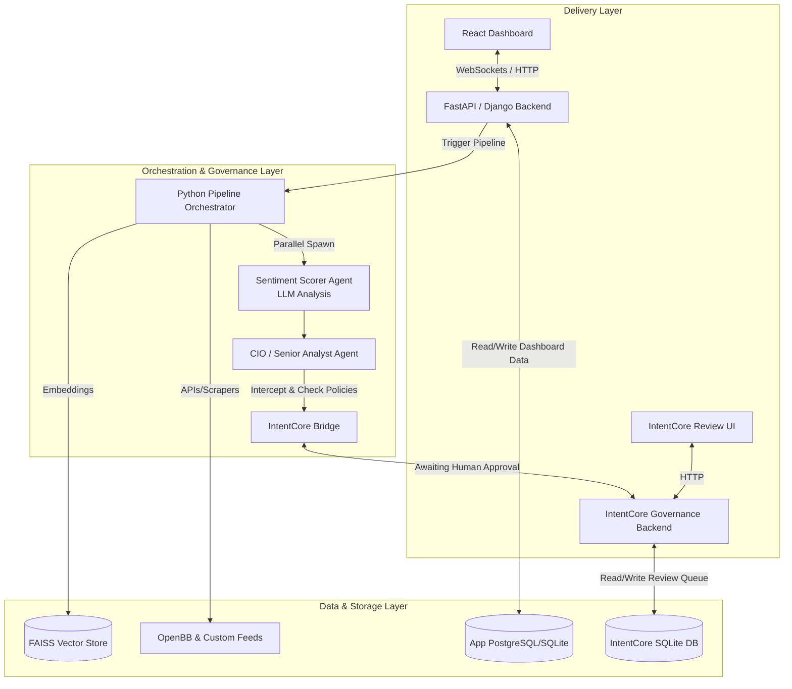
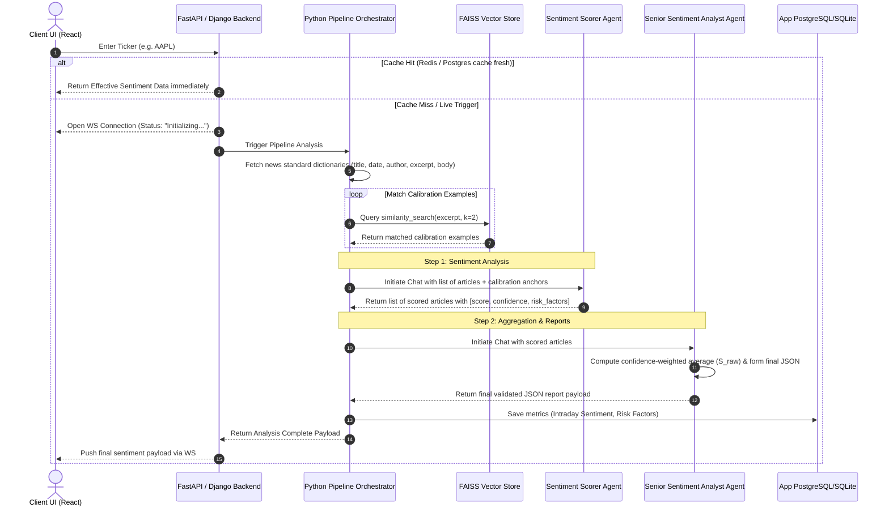

# Architecture & Process Flow: Hybrid Sentiment Governance Pipeline

This document details the architecture, process flow, and integration specifications for the **Two-Agent Sentiment Analyzer** using **FinRobot** and **IntentCore** to populate the portfolio dashboard.

---

## 1. System Architecture

The system is split into three layers:
- **Data & Storage Layer**: Databases and cache stores for fast UI rendering.
- **Orchestration & Governance Layer (FinRobot + IntentCore)**: Multi-agent execution and compliance gates.
- **Application & Delivery Layer (FastAPI/React)**: REST APIs, WebSockets, and UI components.



---

## 2. Process Flow & Math Specifications

The pipeline supports both **Batch/Cached Ingestion** (pre-loaded S&P 500 sectors) and **On-Demand Live Runs** (user-requested tickers) using a coordinated conversation between two specialized agents.



### A. Confidence-Weighted Raw Sentiment ($S_{\text{raw}, j, t}$)
For asset $j$, sentiment scores $s_i \in [-1, 1]$ are averaged over the last 24 hours, weighted by their prediction confidence values $c_i$:

$$S_{\text{raw}, j, t} = \frac{\sum_{i=1}^{M_j} s_{i} \cdot c_{i}}{\sum_{i=1}^{M_j} c_{i}}$$

### B. Effective Ticker Sentiment ($\text{Effective Sentiment}_{j, t}$)
Incorporates rolling macroeconomic shocks ($\mathcal{S}_t$) scaled by sector asset beta sensitivities ($\beta_j$):

$$\text{Effective Sentiment}_{j, t} = S_{\text{raw}, j, t} \times (1 + \beta_j \cdot \mathcal{S}_t)$$

---

## 3. Storage Layer Details

### A. App Database Schema (AppDB)
Handles structured data for tables and graphs shown in your dashboard:
- **`articles` Table**: Title, source, published timestamp, sentiment label, score, reasoning.
- **`intraday_velocity` Table**: Ticker, timestamp (hourly intervals), average sentiment velocity.
- **`corporate_disclosures` Table**: Ticker, Q&A tension index, textual inertia score.
- **`sentiment_leaderboard` Table**: Ticker, overall sentiment compound score, change percentage (30-day).

### B. IntentCore Database Schema (intentcore.db)
An SQLite database storing policy enforcement and audit trails:
- **`reasoning_chains`**: Full serialized inputs/outputs, situation, alternatives considered, completeness assessment, and policies violated.
- **`review_queue`**: Active tasks requiring human approval before the final dashboard payload is confirmed or downstream actions (like trade triggers) are authorized.

### C. FAISS Vector Database
- Built using **NVIDIA Embeddings** from `financial_sentiment.csv`.
- Acts as a fast, local in-memory semantic cache. Provides nearest-neighbor few-shot calibration examples based on news summaries.

---

## 4. Data Schema Contracts

### A. Ingestion News Dictionary Contract
All incoming news channels are standardized into this dictionary before being passed to the Scorer:
```json
{
  "title": "String",
  "date": "ISO8601 String",
  "author": "String",
  "excerpt": "String",
  "body": "String"
}
```

### B. Extraction Payload Contract
The Sentiment Scorer agent returns this payload structure for each news article it scores:
```json
{
  "ticker": "AAPL",
  "sentiment_score": 0.78,
  "confidence": 0.92,
  "risk_factors": ["regulatory_headwind", "supply_chain_disruption"],
  "reasoning_summary": "Strong quarterly guidance offset by regulatory headwind."
}
```

---

## 5. IntentCore Governance

The **IntentCore Gateway** enforces policy validation at the asset weight allocation level:
1. Sentiment changes trigger portfolio optimization calculations.
2. The suggester calculates new target weights $\mathbf{W}_{\text{proposed}}$ based on `Effective Sentiment`.
3. Before executing trades, the FastAPI/Django Backend calls the `IntentCore Gateway` via `POST /v1/validate-weights`.
4. If target weight deviation exceeds compliance limits (e.g., turnover threshold), the action is queued for manual approval or rejected, keeping the system safe.

---

## 6. Streaming & WebSocket Protocol

To make the dashboard feel responsive during live searches, state transitions are streamed over WebSockets:

```json
/* Example Progress Stream Message */
{
  "ticker": "AAPL",
  "status": "processing",
  "step": "scoring_articles",
  "progress": 60,
  "message": "Scoring article 3 of 5..."
}

/* Example Governance Review Message */
{
  "ticker": "AAPL",
  "status": "awaiting_governance",
  "reasoning_chain_id": "rc_aapl_06152026",
  "message": "Aggregate sentiment warning: Mixed sentiment detected. Awaiting Portfolio Manager approval."
}

/* Example Final Payload Message */
{
  "ticker": "AAPL",
  "status": "completed",
  "payload": {
    "aggregate_score": 0.45,
    "aggregate_label": "Positive",
    "warnings": [],
    "articles": [...]
  }
}
```
