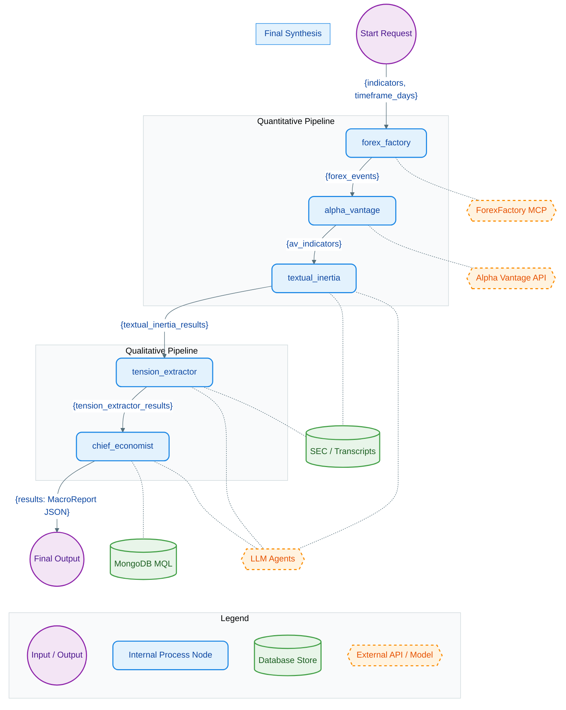
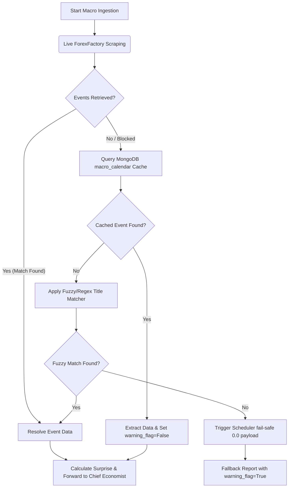

# Macro Ingestion LangGraph Pipeline

This document visualizes the **Macro Ingestion Graph**, illustrating the precise data payloads passed across the graph's `MacroState` and how quantitative/qualitative tools interoperate.

## Detailed Node Workings

1. **`forex_factory`**:
   - **Data Intake**: Takes in the user's `timeframe_days` and `indicators` request.
   - **Inner Workings**: Communicates asynchronously with the **ForexFactory MCP server** to fetch a global macroeconomic calendar and economic events (e.g. CPI prints, rate decisions).
   - **Data Passed Output**: Passes a list of global economic events to the state via the `forex_events` key.

2. **`alpha_vantage`**:
   - **Data Intake**: Consumes `forex_events`.
   - **Inner Workings**: Utilizes a `MacroSurpriseCalibrationAgent` interacting with the **Alpha Vantage API**. It cross-references the scheduled events with trailing historical data to calculate actual vs. consensus "surprise" factors in the market.
   - **Data Passed Output**: Appends the mathematical indicator metrics to the state via the `av_indicators` payload.

3. **`textual_inertia`**:
   - **Data Intake**: Consumes the quantitative indicators.
   - **Inner Workings**: Shifts the pipeline to qualitative analysis. It calls upon a **ChatNVIDIA LLM Agent (Kimi config)** to analyze the "textual inertia" of heavy SEC filings and central bank statements (e.g. tracking subtle hawkish/dovish shifts in FOMC rhetoric over time).
   - **Data Passed Output**: Outputs subjective NLP shifts into `textual_inertia_results`.

4. **`tension_extractor`**:
   - **Data Intake**: Consumes `textual_inertia_results`.
   - **Inner Workings**: Employs another specialized **ChatNVIDIA LLM Agent** to analyze earnings call transcripts and press conferences. It specifically searches for hesitation, conflicting signals, or tension between analysts' Q&A and leadership responses.
   - **Data Passed Output**: Stores the qualitative tension scoring in `tension_extractor_results`.

5. **`chief_economist`**:
   - **Data Intake**: Aggregates all prior state variables (`forex_events`, `av_indicators`, `textual_inertia_results`, `tension_extractor_results`).
   - **Inner Workings**: Acts as the ultimate aggregator. It employs a LangChain Agent armed with the **MongoDB Text-to-MQL Toolkit** to query historical macroeconomic regimes (e.g. previous high-inflation periods) and compare them with the current collected state variables.
   - **Data Passed Output**: Generates a unified, structured macroeconomic outlook schema, storing the final JSON into the `results` key.

---

## Economic Calendar Retrieval Resiliency Flow

When resolving calendar events (e.g., `"CPI m/m"`), the pipeline uses a layered strategy to ensure high availability and bypass anti-bot scrapers:

