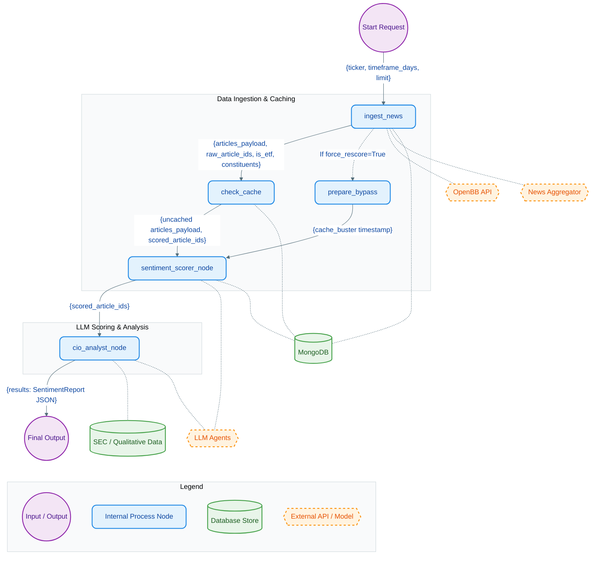

# News Sentiment LangGraph Pipeline

This document visualizes the **News Sentiment Graph**, detailing how the inner nodes interact, the specific state variables (`SentimentState`) they pass to each other, and their external dependencies.

## Detailed Node Workings

1. **`ingest_news`**: 
   - **Data Intake**: Takes in the base request (`ticker`, `timeframe`, `limit`).
   - **Inner Workings**: If the ticker is an ETF, it queries OpenBB to decompose the ETF into its top `holdings` (constituents). It fetches news via the aggregator API.
   - **Data Passed Output**: Prepares the raw articles and passes them as `articles_payload`, along with `raw_article_ids` and `is_etf`/`constituents` metadata. Raw heavy data is stored in MongoDB LangGraph store.

2. **`check_cache` / `prepare_bypass`**: 
   - **Data Intake**: Takes the `articles_payload`.
   - **Inner Workings**: Queries the MongoDB `scored_articles` collection to see if any articles have already been scored by the LLM. 
   - **Data Passed Output**: Splits the payload. Passes ONLY `uncached_articles` via the `articles_payload` field to the LLM scorer. If `force_rescore` is True, `prepare_bypass` simply sets a `cache_buster` timestamp in the state to bypass LangGraph's internal cache mechanism.

3. **`sentiment_scorer_node`**:
   - **Data Intake**: Takes the uncached `articles_payload`.
   - **Inner Workings**: Spins up a LangChain React Agent. It uses a MongoDB Vector Search Retriever to pull financial sentence calibration examples as few-shot context.
   - **Data Passed Output**: Returns the `scored_article_ids` after writing all LLM inferences to the MongoDB `scored_articles` database.

4. **`cio_analyst_node` (Chief Investment Officer)**:
   - **Data Intake**: Takes `scored_article_ids` and the ETF `constituents` metadata.
   - **Inner Workings**: Reads the scored records from MongoDB. It then concurrently executes qualitative worker agents (`textual_inertia`, `tension_extractor`) powered by Kimi LLM on SEC filings. It then calculates mathematical weighted portfolios (`calculate_portfolio_sentiment`).
   - **Data Passed Output**: Outputs the final meticulously structured Pydantic model (`SentimentReport`) stored into the `results` state key.
