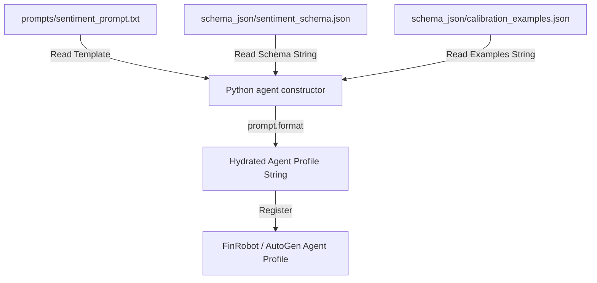

# 📝 Prompt Engineering Standards: The CARE Framework

This document outlines the guidelines and standards for structuring prompt templates in the Sentiment Analysis module. To ensure consistent behavior, high-quality responses, and reliable machine-readable outputs, we adhere to the **CARE framework** (inspired by the [Nielsen Norman Group's "Careful Prompts" guidelines](https://www.nngroup.com/articles/careful-prompts/)) and enforce a **decoupled prompt/schema architecture**.

---

## 🗺️ The CARE Prompting Framework

The acronym **CARE** defines the four essential pillars required to construct robust system prompt profiles for autonomous agents:

1. **Context (`C`)**: Establishes the agent's role, expertise level, operating environment, database access, and specific target constraints.
2. **Ask (`A`)**: Provides a clear, detailed step-by-step procedure of the task the agent needs to perform.
3. **Rules (`R`)**: Enforces strict boundaries, negative constraints (what not to do), compliance rules, output validation details, and termination cues.
4. **Examples (`E`)**: Anchors output quality and formatting expectations with few-shot calibration input-output pairs.

### Structure of a Prompt File

All base prompt templates are stored as `.txt` files in the [sentiment/prompts/](file:///d:/PartnaStudio/sentinel/stack/FinRobot-IntentChain/sentiment/prompts/) directory and follow a uniform markdown-header structure matching the CARE components:

```markdown
You are a [Agent Role Name] operating inside an automated pipeline. Your only audience is...

## CONTEXT
[Context details: description of tools, datasources, and vector cache calibration anchors]

## ASK
Based on the inputs:
1. [Step 1]
2. [Step 2]
...
9. Output a single valid JSON object matching the schema below. No text outside the JSON block.

## RULES
- Output must be a single, valid JSON object. Do not wrap the response in markdown formatting or code fences (e.g., do not use ```json).
- **Self-Correction & Anchoring:** Your JSON schema must always contain a `"reasoning_summary"` or `"thought_process"` key as its *first* property. You must write out your analysis inside this key before generating numerical or categorical outputs to ensure token-level accuracy.
- **Fallback Execution:** The prompt must define explicit default values (e.g., `score: 0.0`, `warning_flag: true`) and reasoning strings if upstream payload components are missing, null, or improperly formatted.
- Always end with TERMINATE on a new line after the closing brace.

## SCHEMA
{SCHEMA}

## EXAMPLES
Input:
{EXAMPLES}

Expected Output:
{OUTPUT}

TERMINATE
```

---

## 📐 Decoupled Schema & Example Storage

To prevent prompt bloat and keep concerns clean, we **do not hardcode** output structures or few-shot examples inside prompt templates. Instead:

- **JSON Output Schemas** are stored in the [sentiment/schema_json/](file:///d:/PartnaStudio/sentinel/stack/FinRobot-IntentChain/sentiment/schema_json/) directory.
- **Reference Examples** (expected outputs, baseline mock inputs) are stored as JSON files alongside schemas.

> [!TIP]
> **Why Decouple Prompts and Schemas?**
> 1. **Cleaner Prompt Management**: Prompt text files stay readable without thousands of lines of schema definitions.
> 2. **JSON Linting and Schema Validation**: IDEs can easily format and validate the JSON schema files (`*.json`) to check for syntax issues.
> 3. **Brace-Escaping (Python `.format()`)**: If JSON schemas were inlined directly in the prompt templates, Python's `.format()` method would get confused by the curly braces `{}` in JSON and throw a `KeyError`. Decoupling them allows loading the schema file as a raw string and injecting it via `{SCHEMA}` without escaping braces inside the schema file itself.

---

## 🔄 Dynamic Hydration & Import Flow

Python agent initialization functions (located in [agents.py](file:///d:/PartnaStudio/sentinel/stack/FinRobot-IntentChain/sentiment/functions/agents.py)) are responsible for loading these files and dynamically stitching them together at runtime.

### The Hydration Lifecycle



### Reference Implementation

The following pattern from [agents.py](file:///d:/PartnaStudio/sentinel/stack/FinRobot-IntentChain/sentiment/functions/agents.py) demonstrates how the prompt and schema are imported, formatted, and bound to the agent:

```python
from .utils.read_and_clean import read_file_content

def create_scorer_agent(prompt_path, schema_path, examples_path, llm_config):
    """Instantiates and returns the Sentiment Scorer agent."""
    # 1. Read files as raw strings
    schema_str = read_file_content(schema_path)
    examples_str = read_file_content(examples_path)
    scorer_prompt_template = read_file_content(prompt_path)
    
    # 2. Inject raw schemas and anchor instructions using python string format
    scorer_profile = scorer_prompt_template.format(
        SCHEMA=schema_str,
        EXAMPLES=examples_str
    )
    
    # 3. Create the FinRobot agent instance
    return FinRobot(
        agent_config={
            "name": "Sentiment_Scorer",
            "description": "Scoration specialist agent.",
            "profile": scorer_profile,
            "toolkits": []
        },
        llm_config=llm_config
    )
```

### Standard Placeholder Keys

When writing prompt templates, ensure the following placeholder variables are wrapped in single curly braces for runtime formatting:
- `{SCHEMA}`: Bound to the validation JSON schema defining validation rules (e.g., `scorer_schema.json`).
- `{EXAMPLES}`: Bound to calibration inline dataset input examples (e.g., `cio_scored_articles.json`).
- `{OUTPUT}`: Bound to the expected sample structural payload/output corresponding to the calibration examples (e.g., `cio_output_schema.json`).

---

## ⚠️ Critical Guidelines

> [!IMPORTANT]
> - **No Text Outside JSON**: System prompts that enforce structured JSON must explicitly rule out trailing/preamble text, markdown wrappers, or markdown fences (such as ```json ... ```).
> - **Termination Protocol**: All prompts must end with the `TERMINATE` instruction keyword on a new line to allow the orchestration loops (such as AutoGen nested chats) to conclude correctly.
> - **Strict Decoupling**: Never write a JSON schema inline in a prompt template file. Keep it in the `schema_json` directory and import it at initialization.
> - **Explicit Type Disambiguation**: Always enforce explicit type casting rules in the prompt text (e.g., stripping non-numeric characters like % or , and converting values to raw floats) to ensure downstream tool call compatibility.
